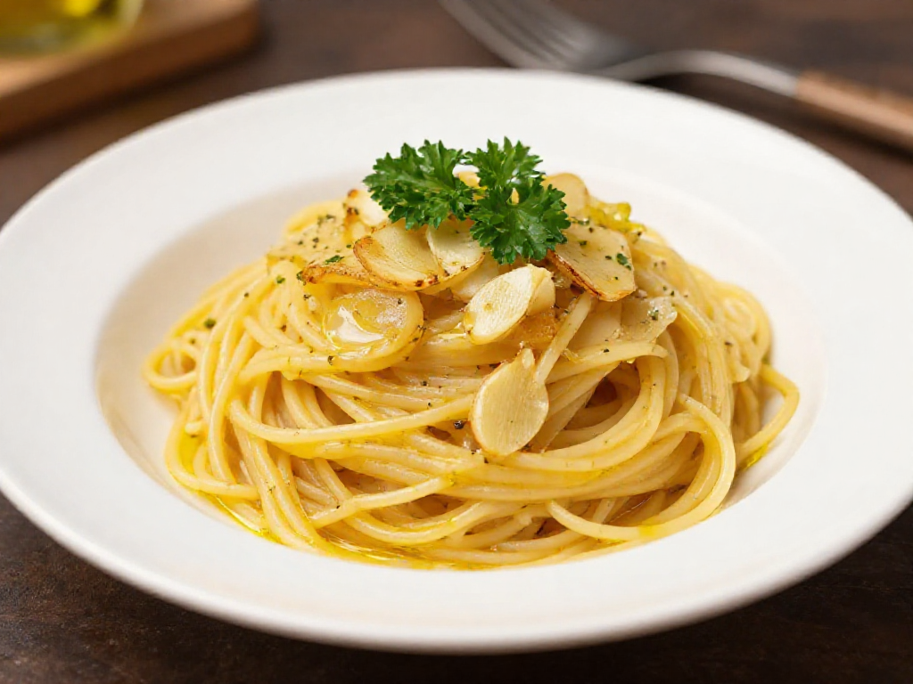

# 초간단 마늘 올리브 파스타 (알리오 올리오)

> 조리시간: 15분 | 1인분 | 난이도: 쉬움

## 재료

- 스파게티 면 — 100g (한 줌)
- 마늘 — 3~4쪽
- 올리브유 (또는 식용유) — 3큰술
- 소금 — 1/2작은술 (면 삶을 물용 포함)
- 후추 — 약간
- 파슬리 또는 쪽파 (선택) — 약간

## 만드는 법

1. 냄비에 물을 넉넉히 붓고 소금 한 꼬집을 넣어 센 불로 끓입니다. 물이 끓으면 스파게티 면을 넣고 봉지에 적힌 시간보다 1분 짧게 삶습니다.

2. 면을 삶는 동안 마늘을 얇게 편 썰기 합니다. (귀찮으면 마늘 가루로 대체 가능해요!)

3. 프라이팬에 올리브유를 두르고 중약 불로 켠 뒤, 마늘을 넣어 노릇노릇해질 때까지 1~2분 볶습니다. 마늘이 타지 않도록 주의하세요.

4. 삶은 면을 건져 프라이팬에 넣고, 면 삶은 물을 두 국자(약 100ml) 추가합니다. 센 불로 올려 30초간 빠르게 섞으며 소스를 면에 흡수시킵니다.

5. 불을 끄고 소금, 후추로 간을 맞춥니다. 그릇에 담고 파슬리나 쪽파를 올리면 완성!

## 꿀팁

- **설거지 줄이기**: 면 건질 때 집게를 사용하면 프라이팬으로 바로 옮길 수 있어 체망을 따로 쓸 필요가 없어요. 냄비 하나 + 프라이팬 하나로 끝!

- **올리브유가 없다면**: 식용유로 대체해도 충분히 맛있어요. 버터를 1큰술 섞으면 더 고소한 맛이 납니다.

- **매운맛 좋아한다면**: 마늘 볶을 때 고춧가루나 청양고추를 함께 넣으세요. 불향 나는 매콤한 파스타로 변신!

- **면 삶은 물은 황금**: 파스타 소스가 너무 뻑뻑하면 면 삶은 물을 조금씩 추가해 농도를 조절하세요. 소금과 전분이 들어있어 소스를 부드럽게 만들어줘요.

- **면 보관 팁**: 남은 면은 올리브유를 살짝 버무려 냉장 보관하면 다음 날도 붙지 않아요.
